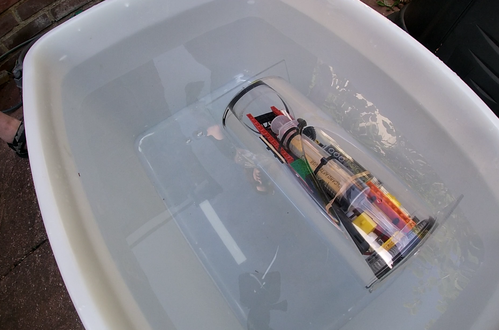

# Onyx V1 — Submersion Testing Record

This file records the water tests performed during V1 and the observations that should carry forward into V2.

Unlike the build notes, this is not a component-by-component design record. It is a practical test history: what was put in the water, what happened, and what that means for the next stage.

---

## Summary

The V1 submersion tests confirmed that the submarine could be assembled, sealed, placed in water, and actuated, but not with enough reliability or stability to continue developing V1.

The main outcomes were:

- Bluetooth control is not viable underwater; the connection is lost as soon as the unit submerges.
- The hull seal is not reliable enough for electronics-first testing.
- The Schrader valve did not seal gas properly during syringe operation.
- The syringe ballast mechanism itself was mechanically promising.
- Ballast distribution and internal layout produced poor balance.

V1 should therefore be treated as complete. V2 should begin with empty-hull seal validation, then buoyancy and ballast tests, before any powered electronics are installed.

---

## Test Record

### T1 — Initial Powered Submersion

*The Onyx shortly after being placed in the water for the first time. You can see the heavy listing, which was largely due to difficulty distributing the ballast effectively as a result of general crampt conditions on board.*

**Date:** [08/04/2026, 17:50 BST]

**Goal:**
Confirm whether the assembled submarine could be controlled while submerged.

**Setup:**
- Full V1 hull assembled with internal chassis installed.
- Pi Pico, HC-05 Bluetooth module, motor driver, power bank, ballast syringe, and lead shot ballast fitted.
- Control attempted from an Android phone using the SerialConnector app.

**Result:**
Although the syringe ballast could be actuated, the submarine did not dive below the surface.

**Observations:**
- The electronics and syringe actuator worked well.
- The submarine was listing heavily in the water.
- The syringe appeared around half full of air due to drawing it from the tube, it is still assumed that 40ml of water was successfully onboard, though this was not measured.
- The submarine was observed to be taking on water, which may have been due to the hull seal, the Schrader valve, or both.

**Conclusion:**
The definitive reason that the submarine did not submerge is not known, but the most likely cause is that the ballast was insufficient to overcome the buoyancy of the hull and internal components. The listing suggests that the ballast was also unevenly distributed, which would have made it harder to submerge.

**Issues to Carry Forward:**
- Must ensure ballast is sufficient to submerge the hull with all internal components installed.
- Must design the internal layout to allow for even ballast distribution.

---

### T2 — Autonomous Dive / Resurface Attempt

**Date:** [22/04/2026, 18:30 BST]

**Goal:**
To repeat the submersion test with the ballast more evenly distributed. 

**Setup:**
- As per test T1, but with the lead shot ballast distributed more evenly across the hull.

**Result:**
There was still some listing, but considerably less than T1, however, there was no improvement in the submarine's ability to submerge.

**Observations:**
- The submarine was more balanced than in T1, but still not level.
- The submarine did not submerge at all, even with the ballast syringe fully actuated.
- The submarine was observed to be taking on water, which may have been due to the hull seal, the Schrader valve, or both.
- The shrader valve was observed to be leaking air, when the syringe was actuated.

**Conclusion:**
The most likely reason that the submarine did not submerge is that the ballast was still insufficient to overcome the buoyancy of the hull and internal components. The listing suggests that the ballast was still unevenly distributed, which would have made it harder to submerge. The leaking Schrader valve may also have reduced the effective ballast.

**Issues to Carry Forward:**
- Must ensure ballast is sufficient to submerge the hull with all internal components installed.
- Must design the internal layout to allow for even ballast distribution.
- Must find a more reliable method of sealing the ballast water inside the hull, as the Schrader valve is not sufficient.

---

## V2 Test Protocol

Use this progression for V2 testing:

1. Empty hull dry assembly check.
2. Empty hull pressure or vacuum seal test.
3. Empty hull static submersion test.
4. Unpowered buoyancy test with ballast only.
5. Ballast mechanism bench test.
6. Ballast mechanism wet test without control electronics.
7. Powered dry integration test.
8. Powered shallow-water test.
9. Communication test underwater.
10. Propulsion test only after sealing, buoyancy, and ballast are stable.

Each test entry should record:

- Date.
- Goal.
- Exact hardware configuration.
- Environment, depth, and duration.
- Whether electronics were installed and powered.
- Observed leaks, bubbles, tilt, resets, signal loss, or mechanical binding.
- Decision made after the test.

